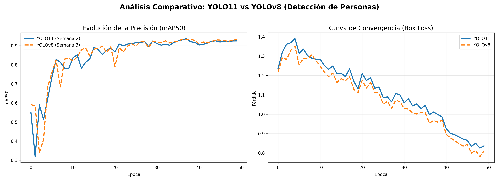

# Optimización de Arquitecturas YOLO11 para Vigilancia Urbana - USACH

[cite_start]Este repositorio contiene el desarrollo de un sistema de detección de personas y optimización de rendimiento para aplicaciones de vigilancia en tiempo real[cite: 389, 394]. [cite_start]El proyecto se enfoca en superar el cuello de botella del procesamiento en 4K mediante un análisis multiresolución[cite: 6, 7].

## 🛠️ Especificaciones Técnicas
* [cite_start]**Hardware:** GPU NVIDIA Tesla T4 (Google Colab)[cite: 15, 248].
* [cite_start]**Framework:** Ultralytics YOLO11 (Versión Nano para baja latencia)[cite: 249, 262, 468].
* [cite_start]**Entorno:** Python 3.10+ con persistencia en Google Drive[cite: 249, 357].

## 📊 Comparativa de Entrenamiento (YOLO11 vs YOLOv8)

*Figura 1: Evolución de precisión y pérdida durante el entrenamiento.*

## 📈 Resultados Destacados (Hito Semana 5)
[cite_start]Logramos una mejora de rendimiento del **1,400%** al ajustar la resolución de entrada[cite: 79, 80].
* [cite_start]**Línea Base (4K):** 7.10 FPS[cite: 5, 161].
* **Optimizado (640p):** 107.03 FPS.
* [cite_start]**Sweet Spot:** Se identificó 640p como la resolución óptima entre precisión y velocidad[cite: 74, 85].

## 📂 Estructura del Proyecto (Evolución Semanal)
Para garantizar la **reproducibilidad**, el proyecto se organiza de la siguiente manera:

* [cite_start]**[Semana 1-2: Entrenamiento](./Semana-2_Entrenamiento):** Fine-tuning inicial del modelo YOLO11n con dataset de Roboflow[cite: 448, 452, 456].
* [cite_start]**[Semana 3: Comparativa](./Semana-3_Comparativa):** Benchmark directo entre YOLO11 y YOLOv8[cite: 272, 277].
* [cite_start]**[Semana 4: Validación 4K](./Semana-4_Benchmarking):** Identificación del cuello de botella en alta resolución[cite: 91, 153].
* [cite_start]**[Semana 5: Optimización](./Semana-5_Optimizacion):** Análisis multiresolución y curvas de trade-off[cite: 7, 30].

## 🎥 Cápsulas de Logros (Videos)
* [cite_start]**Logro 1:** Detección estable en resolución 1088p (>55 FPS)[cite: 34, 37].
* [cite_start]**Logro 2:** Demostración de tiempo real a 107 FPS en 640p[cite: 79].

## 🚀 Resultados Finales de Benchmarking (Master Notebook)
| Arquitectura | Resolución | FPS Reales | Latencia Total |
| :--- | :--- | :--- | :--- |
| **YOLO11n (USACH)** | 320p | **25.09** | 39.8 ms |
| **YOLOv8n (Base)** | 320p | 23.02 | 43.4 ms |
| **R-CNN (Legacy)** | 640p | 0.19 | 5209.5 ms |

### 🖼️ Análisis Multi-resolución (Hito Semana 5)
A continuación se muestran las validaciones visuales tras el ajuste de stride 32:
* **Alta Fidelidad (1088p):** [Ver captura](./Semana-5-Optimizacion/1088p.png)
* **Balance Ideal (640p):** [Ver captura](./Semana-5-Optimizacion/640p.png)
* **Máximo Rendimiento (320p):** [Ver captura](./Semana-5-Optimizacion/320p.png)
